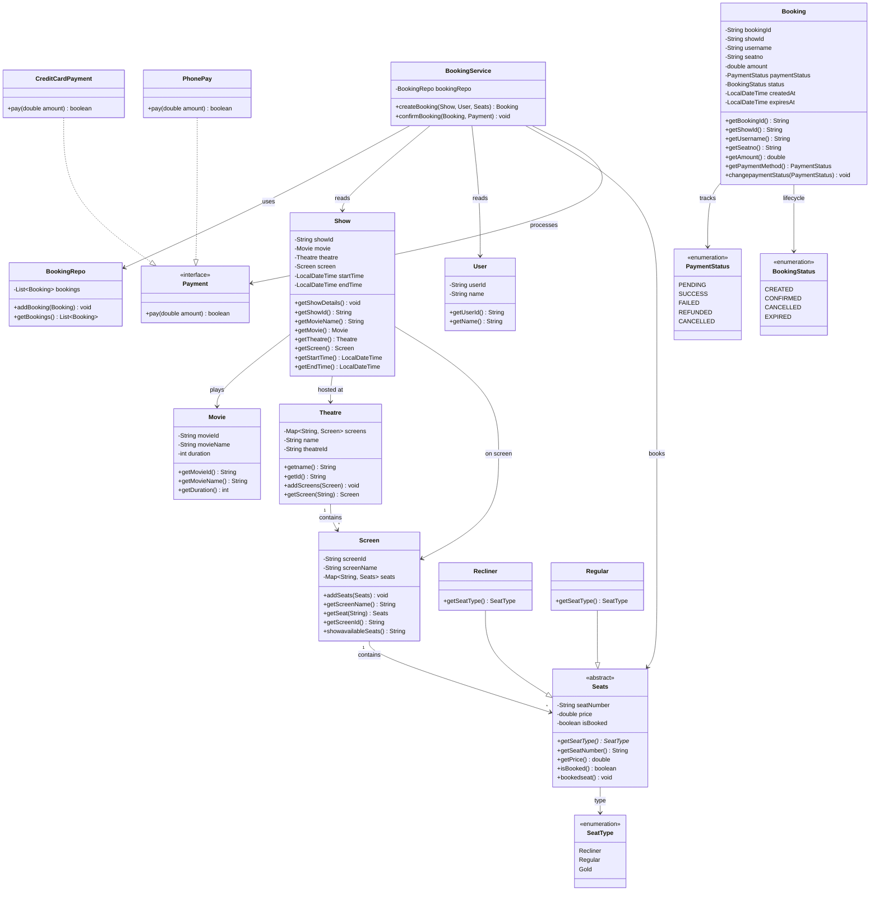
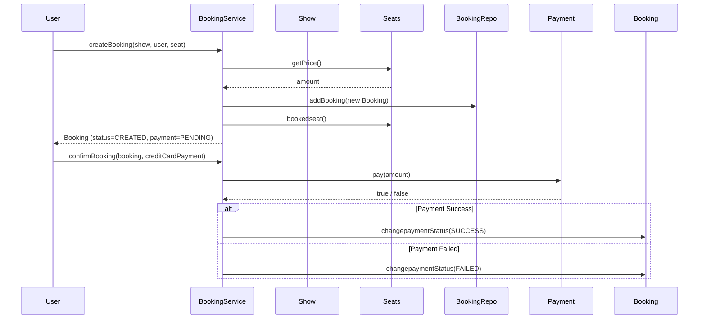
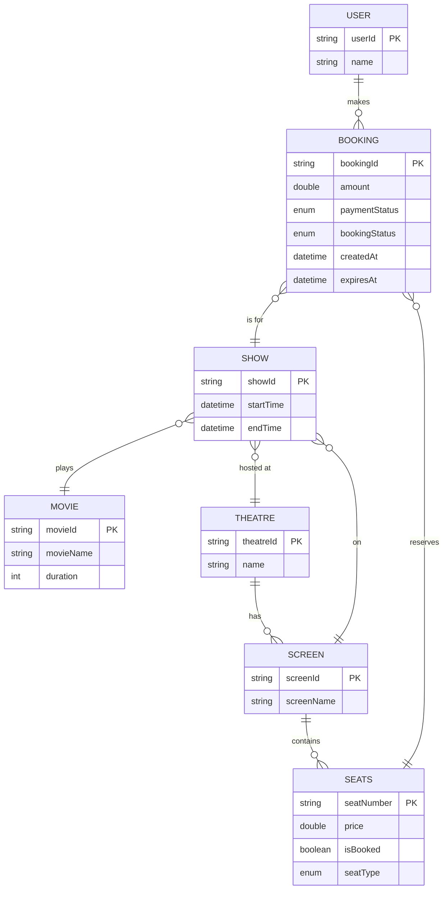

# 🎬 Movie Booking System — Low Level Design (Java)

A complete **Low Level Design** implementation of a Movie Ticket Booking System in Java, demonstrating core OOP principles, design patterns, and clean package separation.

---

## 📌 What This Project Does

Simulates the end-to-end flow of booking a movie ticket:

1. **Create** a Movie, Theatre, Screen, and Seats
2. **Schedule** a Show (movie + screen + theatre + time)
3. **Book** a seat for a user
4. **Pay** via a chosen payment method (Credit Card / PhonePe)
5. **Confirm** the booking and mark the seat as booked

---

## 🗂️ Project Structure

```
MovieBookingSystem/
├── Main.java                        # Entry point — wires everything together
├── bookingService/
│   ├── Booking.java                 # Booking entity (id, show, user, seat, amount, status)
│   ├── BookingRepo.java             # In-memory repository (List<Booking>)
│   ├── BookingService.java          # Orchestrates create + confirm booking
│   └── BookingStatus.java           # Enum: CREATED, CONFIRMED, CANCELLED, EXPIRED
├── movieService/
│   └── Movie.java                   # Movie entity (id, name, duration)
├── theatreService/
│   └── Theatre.java                 # Theatre entity (name, id, Map<Screen>)
├── screenservice/
│   └── Screen.java                  # Screen entity (id, name, Map<Seats>)
├── showservice/
│   └── Show.java                    # Show entity (movie + theatre + screen + time)
├── seats/
│   ├── Seats.java                   # Abstract base class for all seats
│   ├── SeatType.java                # Enum: Recliner, Regular, Gold
│   ├── Recliner.java                # Concrete seat — extends Seats
│   └── Regular.java                 # Concrete seat — extends Seats
├── paymentService/
│   ├── Payment.java                 # Interface with pay(amount) → Strategy Pattern
│   ├── CreditCardPayment.java       # Concrete strategy
│   ├── PhonePay.java                # Concrete strategy
│   └── PaymentStatus.java           # Enum: PENDING, SUCCESS, FAILED, REFUNDED, CANCELLED
├── user/
│   └── User.java                    # User entity (id, name)
└── lockMechanism/                   # (Placeholder — for future seat locking)
```

---

## 📐 UML Class Diagram



---

## 🔄 Booking Flow — Sequence Diagram



---

## 🧩 Design Patterns Used

| Pattern | Where | Why |
|---------|-------|-----|
| **Strategy** | `Payment` interface → `CreditCardPayment`, `PhonePay` | Swap payment methods at runtime without changing `BookingService` |
| **Repository** | `BookingRepo` | Decouples data storage from business logic; easy to swap with a DB later |
| **Template Method (light)** | `Seats` (abstract) → `Recliner`, `Regular` | Base class defines structure; subclasses provide seat-type-specific behavior |
| **Composition** | `Show` has `Movie`, `Theatre`, `Screen` | Rich domain objects composed from simpler entities |

---

## 🧱 Package-by-Package Breakdown

### `seats/` — Seat Hierarchy
- **`Seats`** is an abstract class with `seatNumber`, `price`, `isBooked`.
- Subclasses `Recliner` and `Regular` override `getSeatType()`.
- `SeatType` enum has `Recliner`, `Regular`, `Gold` (Gold is defined but not yet implemented).
- Seats are marked booked via `bookedseat()` — a simple boolean flip, no concurrency handling yet.

### `screenservice/` — Screen Management
- A `Screen` holds a `Map<String, Seats>` keyed by seat number.
- `showavailableSeats()` iterates the map and returns unbooked seat IDs.

### `theatreService/` — Theatre Management
- A `Theatre` holds a `Map<String, Screen>` keyed by screen ID.
- Simple add/get operations.

### `showservice/` — Show Scheduling
- A `Show` links a `Movie` + `Theatre` + `Screen` + start time.
- `endTime` is auto-calculated as `startTime + movie.duration`.

### `bookingService/` — Booking Orchestration
- **`BookingService.createBooking()`**: calculates price, creates a `Booking`, persists it in `BookingRepo`, and marks the seat as booked.
- **`BookingService.confirmBooking()`**: delegates to a `Payment` strategy; updates `PaymentStatus` accordingly.
- **`Booking`** tracks `createdAt` and `expiresAt` (1-hour window) — expiry logic is modeled but not yet enforced.

### `paymentService/` — Payment Strategy
- `Payment` interface with a single method `pay(double) → boolean`.
- `CreditCardPayment` and `PhonePay` are concrete strategies (currently always return `true`).

### `lockMechanism/` — Seat Locking (Future)
- Empty directory — placeholder for implementing seat-level locking / concurrency control (e.g., optimistic locking, TTL-based locks).

---

## ▶️ How to Run

```bash
# Compile everything
javac -d out Main.java

# Run
java -cp out Main
```

### Expected Output

```
250.0
false
========================================
              SHOW DETAILS
========================================
Show ID       : SH1
Movie         : Inception
Theatre       : PVR Cinemas
Screen        : Screen 1
Start Time    : 2026-09-20T18:30
End Time      : 2026-09-20T20:58
========================================
Available seats: R1 R2 N1
Processing credit card payment of amount: 250.0
Booking ID   : 1
Show ID      : SH1
User         : Alice
Seat         : R1
Amount       : 250.0
Payment      : SUCCESS
Available seats after booking: R2 N1
```

---

## 🧭 Entity Relationship Diagram



---

## 🚀 What Could Be Added Next

| Feature | Notes |
|---------|-------|
| **Seat Locking** | Use the `lockMechanism/` package — implement TTL-based locks so two users can't book the same seat simultaneously |
| **Gold Seat** | `SeatType.Gold` enum exists but no `Gold.java` class yet |
| **Booking Expiry** | `expiresAt` is set but never checked — add a scheduled job or lazy check |
| **Search** | Search movies by city, theatre, or time slot |
| **Notifications** | Email/SMS confirmation after booking |
| **Cancellation & Refund** | Use `BookingStatus.CANCELLED` + `PaymentStatus.REFUNDED` |
| **Multiple Seats per Booking** | Currently 1 seat per booking — extend to `List<Seats>` |

---

## 📚 Key OOP Concepts Demonstrated

- **Abstraction** — `Seats` abstract class hides seat internals; `Payment` interface hides payment details
- **Inheritance** — `Recliner` and `Regular` extend `Seats`
- **Polymorphism** — `BookingService.confirmBooking()` accepts any `Payment` implementation
- **Encapsulation** — All fields are `private` with getter methods
- **Composition** — `Show` is composed of `Movie`, `Theatre`, and `Screen`
- **Interface Segregation** — `Payment` has a single focused method
