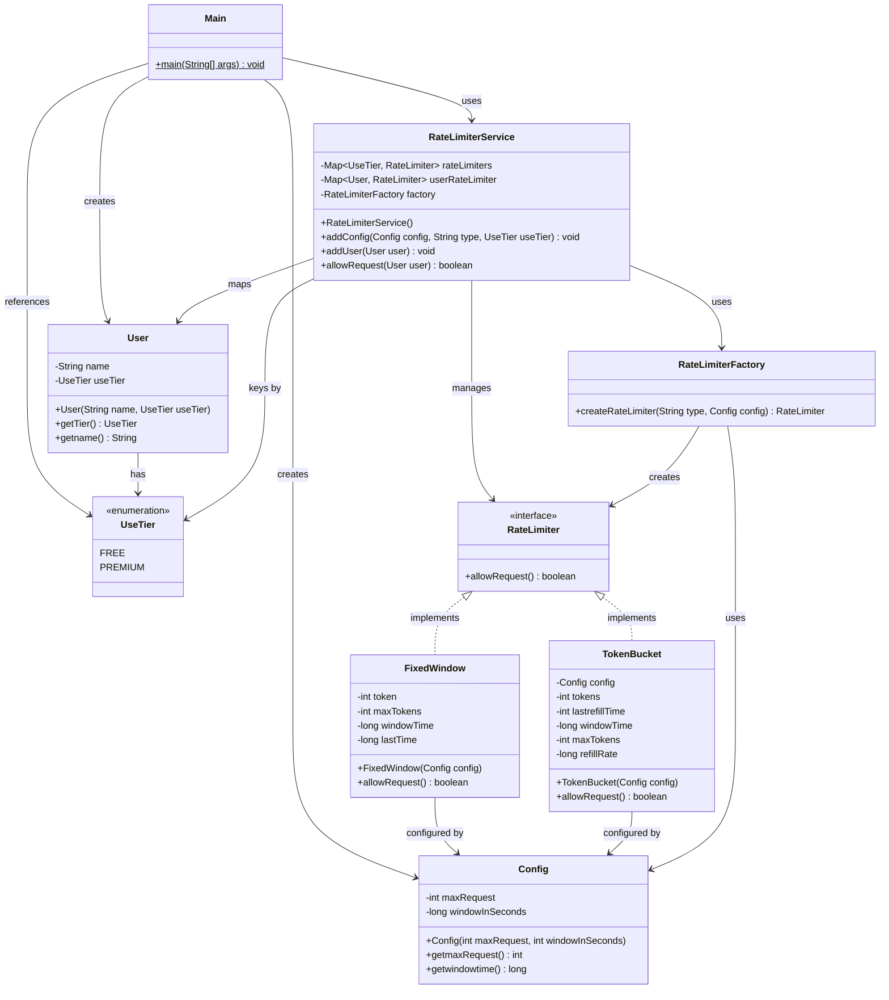

# 🚦 Rate Limiter — Low Level Design

A **Rate Limiter** system built in Java that controls the rate of incoming requests per user based on their subscription tier. It demonstrates core LLD concepts including **Strategy Pattern**, **Factory Pattern**, and **clean separation of concerns**.

---

## 📖 Overview

Rate limiting is a critical technique used in distributed systems and APIs to:
- **Prevent abuse** — protect services from malicious or accidental overuse.
- **Ensure fairness** — distribute resources evenly among users.
- **Maintain stability** — avoid cascading failures under heavy load.

This project implements a configurable rate limiter that supports **multiple algorithms** and **tier-based throttling**, allowing different rate limiting strategies for FREE vs PREMIUM users.

---

## 🏗️ Architecture & Design Patterns

| Pattern | Where Used | Purpose |
|---------|-----------|---------|
| **Strategy** | `RateLimiter` interface + `TokenBucket`, `FixedWindow` | Swap rate limiting algorithms at runtime without changing client code |
| **Factory** | `RateLimiterFactory` | Encapsulate object creation logic; create the right `RateLimiter` from a string type |
| **Service Layer** | `RateLimiterService` | Central orchestrator that maps users → rate limiters via their tier |

---

## 📂 Project Structure

```
RateLimiter/
├── Main.java                              # Entry point — demo usage
├── Readme.md
│
├── user/
│   └── User.java                          # User entity (name + tier)
│
├── userTier/
│   └── UseTier.java                       # Enum: FREE, PREMIUM
│
└── rateLimiter/
    ├── RateLimiterService.java            # Service layer — orchestrates everything
    │
    ├── config/
    │   └── Config.java                    # Holds maxRequests & windowInSeconds
    │
    └── ratelimter/
        ├── RateLimiter.java               # Strategy interface
        ├── RateLimiterFactory.java         # Factory to create rate limiters
        ├── TokenBucket.java               # Token Bucket algorithm
        └── FixedWindow.java               # Fixed Window Counter algorithm
```

---

## 📐 UML Class Diagram



---

## ⚙️ Rate Limiting Algorithms

### 1. Token Bucket 🪣

The **Token Bucket** algorithm works like a bucket that holds tokens:

- The bucket starts full with `maxTokens` tokens.
- Each request **consumes 1 token**. If the bucket is empty, the request is **denied**.
- Tokens are **refilled** over time at a steady rate (`windowTime / maxTokens` seconds per token).
- This allows **burst traffic** up to the bucket capacity, then smoothly throttles.

```
Time ──────────────────────────────────►
Tokens: [3] → req → [2] → req → [1] → req → [0] → DENIED
                                         ↑ refill → [1] → req → [0]
```

**Key properties:**
- ✅ Allows short bursts
- ✅ Smooth long-term rate
- ✅ Memory efficient (per-user state: tokens + timestamp)

---

### 2. Fixed Window Counter 🪟

The **Fixed Window** algorithm divides time into fixed-size windows:

- A counter tracks requests in the **current window**.
- Each request **decrements** the counter. If counter reaches 0, the request is **denied**.
- When the window **expires** (elapsed time ≥ window size), the counter **resets** to `maxTokens`.

```
|◄── Window 1 (60s) ──►|◄── Window 2 (60s) ──►|
  req req req ... DENIED   req req req ...
  [20] [19] [18]   [0]    [20] [19] [18]
```

**Key properties:**
- ✅ Simple to implement
- ✅ Predictable limits per window
- ⚠️ Susceptible to boundary burst (requests at end + start of adjacent windows)

---

## 🔧 Configuration

Rate limiting behavior is configured per tier via the `Config` class:

| Parameter | Description | Example |
|-----------|-------------|---------|
| `maxRequest` | Maximum requests allowed in one window | `3` (FREE), `20` (PREMIUM) |
| `windowInSeconds` | Duration of the time window in seconds | `60` |

**Tier Mapping Example:**

| Tier | Algorithm | Max Requests | Window |
|------|-----------|-------------|--------|
| `FREE` | Token Bucket | 3 | 60s |
| `PREMIUM` | Fixed Window | 20 | 60s |

---

## 🚀 Usage Example

```java
// 1. Create the service
RateLimiterService rateLimiterService = new RateLimiterService();

// 2. Configure rate limits per tier
rateLimiterService.addConfig(new Config(3, 60), "TokenBucket", UseTier.FREE);
rateLimiterService.addConfig(new Config(20, 60), "FixedWindow", UseTier.PREMIUM);

// 3. Create and register users
User freeUser = new User("Shubham", UseTier.FREE);
rateLimiterService.addUser(freeUser);

User premiumUser = new User("Suyash", UseTier.PREMIUM);
rateLimiterService.addUser(premiumUser);

// 4. Check if requests are allowed
boolean allowed = rateLimiterService.allowRequest(premiumUser);
System.out.println("Request allowed: " + allowed);
```

**Sample Output:**
```
FixedWindow: Request allowed. Tokens left: 19
Request 0 allowed: true
FixedWindow: Request allowed. Tokens left: 18
Request 1 allowed: true
...
FixedWindow: Request denied. No tokens available.
Request 20 allowed: false
```

---

## 🧩 How to Run

```bash
# Compile all Java files
javac Main.java user/*.java userTier/*.java rateLimiter/*.java rateLimiter/config/*.java rateLimiter/ratelimter/*.java

# Run
java Main
```

---

## 🔑 Key Design Decisions

1. **Interface-based strategy** — Adding a new algorithm (e.g., Sliding Window, Leaky Bucket) only requires implementing `RateLimiter` and registering it in the factory.
2. **Tier-level configuration** — Configs are mapped to tiers, not individual users, keeping the system scalable.
3. **Dynamic config updates** — `addConfig()` retroactively updates all existing users of that tier.
4. **Factory encapsulation** — Client code never directly instantiates algorithm classes; it uses string identifiers through the factory.

---

## 🧭 Extensibility

To add a **new rate limiting algorithm** (e.g., Sliding Window Log):

1. Create a new class implementing `RateLimiter`:
   ```java
   public class SlidingWindowLog implements RateLimiter {
       public boolean allowRequest() { /* ... */ }
   }
   ```
2. Register it in `RateLimiterFactory`:
   ```java
   else if (type.equals("SlidingWindowLog")) {
       return new SlidingWindowLog(config);
   }
   ```
3. Use it in config:
   ```java
   rateLimiterService.addConfig(config, "SlidingWindowLog", UseTier.PREMIUM);
   ```

No changes needed in `RateLimiterService`, `User`, or any other class — **Open/Closed Principle** in action. ✅
