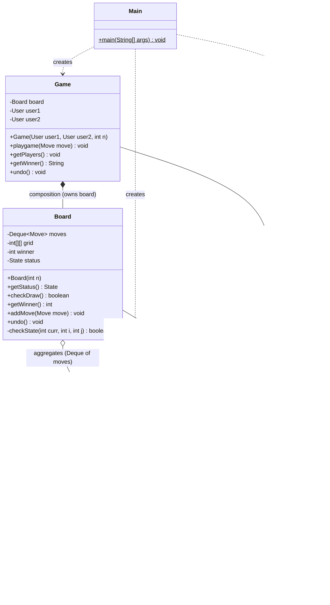
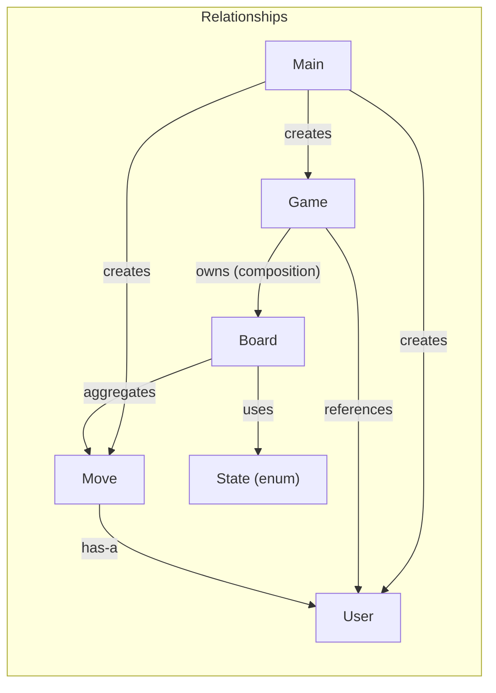
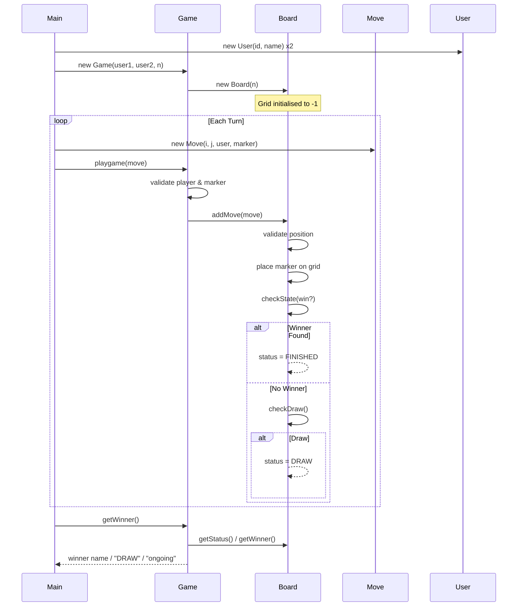

# Tic-Tac-Toe — Low Level Design (LLD) Documentation

## 1. UML Class Diagram


<details>
<summary>Mermaid Source (for GitHub rendering)</summary>



</details>

---

## 2. Package Structure

```
TIC-TAC-TOE/
├── Main.java               # Entry point — sets up users, game, and plays moves
├── board/
│   ├── Board.java           # Core board logic — grid, win/draw detection, undo
│   └── State.java           # Enum for game state (PLAYING, FINISHED, DRAW)
├── game/
│   └── Game.java            # Game orchestrator — validates and delegates moves
├── moves/
│   └── Move.java            # Represents a single move (position + player + marker)
├── user/
│   └── User.java            # Player entity (id + name)
└── docs/
    └── UML_DIAGRAM.md       # This file
```

---

## 3. Class Descriptions

### 3.1 `User` (package: `user`)
Represents a player in the game.

| Field       | Type     | Description                      |
|-------------|----------|----------------------------------|
| `user_id`   | `int`    | Unique identifier for the user   |
| `name`      | `String` | Display name of the user         |

**Key Methods:**
- `getname()` — returns the player's name (used for identity checks throughout the game).
- `getId()` — returns the player's unique id.

---

### 3.2 `Move` (package: `moves`)
Encapsulates a single move made by a player.

| Field  | Type   | Description                                           |
|--------|--------|-------------------------------------------------------|
| `user` | `User` | The player making this move                           |
| `i`    | `int`  | Row index on the board (0-indexed)                    |
| `j`    | `int`  | Column index on the board (0-indexed)                 |
| `move` | `int`  | Marker value (`1` for player 1, `2` for player 2)    |

**Key Methods:**
- `getI()`, `getJ()` — return the board coordinates.
- `getUserName()` — delegates to `User.getname()` to get the player's name.
- `getMove()` — returns the marker value placed on the grid.

---

### 3.3 `State` (package: `board`)
An **enum** representing the current state of the game.

| Value      | Meaning                                  |
|------------|------------------------------------------|
| `PLAYING`  | Game is in progress                      |
| `FINISHED` | A player has won                         |
| `DRAW`     | All cells are filled with no winner      |

---

### 3.4 `Board` (package: `board`)
The core component. Manages the NxN grid, tracks all moves, detects wins/draws, and supports undo.

| Field    | Type           | Description                                              |
|----------|----------------|----------------------------------------------------------|
| `moves`  | `Deque<Move>`  | Stack of all moves played (supports undo via `pollLast`) |
| `grid`   | `int[][]`      | NxN grid; `-1` = empty, otherwise holds marker value     |
| `winner` | `int`          | Marker value of the winner (`-1` if no winner yet)       |
| `status` | `State`        | Current game state                                       |

**Key Methods:**

| Method                                | Description                                                                                                  |
|---------------------------------------|--------------------------------------------------------------------------------------------------------------|
| `Board(int n)`                        | Initialises an NxN grid filled with `-1` (empty).                                                            |
| `addMove(Move move)`                  | Validates the move (game not over, not same user twice, position not occupied), places it, checks win/draw.  |
| `checkState(int curr, int i, int j)`  | Checks if the current marker wins — inspects the row, column, main diagonal, and anti-diagonal.              |
| `checkDraw()`                         | Returns `true` if every cell is occupied and no winner has been declared.                                    |
| `undo()`                              | Removes the last move from the deque and resets the grid cell to `-1`.                                       |
| `getStatus()`                         | Returns the current `State`.                                                                                 |
| `getWinner()`                         | Returns the winning marker value.                                                                            |

---

### 3.5 `Game` (package: `game`)
The **orchestrator / facade** that ties players and the board together. Validates player identity and marker assignment before delegating to `Board`.

| Field   | Type    | Description                        |
|---------|---------|------------------------------------|
| `board` | `Board` | The game board (composition)       |
| `user1` | `User`  | Player 1 (always uses marker `1`)  |
| `user2` | `User`  | Player 2 (always uses marker `2`)  |

**Key Methods:**

| Method                   | Description                                                                                            |
|--------------------------|--------------------------------------------------------------------------------------------------------|
| `Game(User u1, User u2, int n)` | Creates both players and a new NxN board.                                                        |
| `playgame(Move move)`    | Validates game state, player identity, and marker correctness before calling `board.addMove(move)`.    |
| `getPlayers()`           | Prints the matchup (e.g. `Rohit  v/s  Rahul`).                                                        |
| `getWinner()`            | Returns the winner's name, `"DRAW"`, or `"Game is still ongoing"`.                                     |
| `undo()`                 | Delegates to `board.undo()` to reverse the last move.                                                  |

---

### 3.6 `Main`
The entry point. Creates `User` objects, a `Game`, issues `Move` commands, and demonstrates the **undo** feature.

---

## 4. Relationships Summary



| Relationship          | Type            | Description                                                      |
|-----------------------|-----------------|------------------------------------------------------------------|
| `Game` → `Board`      | **Composition** | Game owns the board; board does not exist independently.         |
| `Game` → `User`       | **Association**  | Game holds references to two players.                            |
| `Move` → `User`       | **Composition** | Each move is permanently tied to the player who made it.         |
| `Board` → `Move`      | **Aggregation**  | Board maintains an ordered collection (Deque) of moves.         |
| `Board` → `State`     | **Dependency**   | Board uses the State enum to track game progress.               |
| `Main` → `Game/User/Move` | **Dependency** | Main creates and orchestrates all objects.                    |

---

## 5. Game Flow (Sequence)



---

## 6. Design Patterns & Principles Used

| Pattern / Principle              | Where Applied                                                                                   |
|----------------------------------|-------------------------------------------------------------------------------------------------|
| **Single Responsibility (SRP)**  | Each class has one job: `User` = identity, `Move` = action, `Board` = rules, `Game` = orchestration. |
| **Encapsulation**                | All fields are `private`; access is through getters. Grid manipulation is internal to `Board`.  |
| **Facade Pattern**               | `Game` acts as a facade — clients interact with `Game` without knowing `Board` internals.       |
| **Command Pattern (partial)**    | `Move` objects encapsulate actions; the `Deque<Move>` stack enables **undo** functionality.     |
| **Enum for State**               | `State` enum eliminates magic strings/ints for game status, improving type safety.              |

---

## 7. Key Features

- **NxN Board Support** — The board size is configurable (not limited to 3x3).
- **Win Detection** — Checks rows, columns, main diagonal, and anti-diagonal after each move.
- **Draw Detection** — Automatically detects when the board is full with no winner.
- **Undo Support** — Uses a `Deque` stack to reverse the last move and reset the grid cell.
- **Validation** — Prevents duplicate consecutive moves by the same player, occupied cell overwrites, and moves after game end.
- **Player-Marker Binding** — `user1` is always marker `1`, `user2` is always marker `2`.
